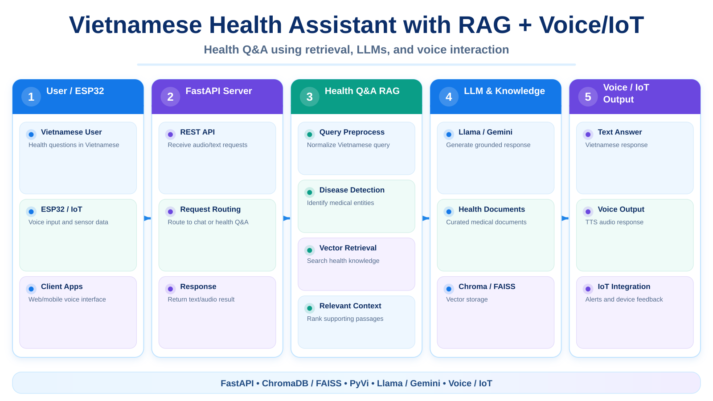

# 🩺 Vietnamese Health Assistant with RAG + Voice/IoT

> A Vietnamese health-assistant project that combines **RAG, Large Language Models, voice processing and IoT integration** to answer disease-related questions from a curated knowledge base.

  

---

## 📌 Introduction

Health_Bot_RAG builds a medical Q&A backend around Retrieval-Augmented Generation. The system retrieves health information from local documents, detects disease names in Vietnamese queries, sends the retrieved context to an LLM, and exposes the result through FastAPI.

The repository also contains an IoT/voice layer for wake-word detection, speech input and audio output so the assistant can be integrated with devices such as ESP32-based hardware.

---

## 🚀 Key Features

- 🩺 Disease-related Q&A using RAG.
- 🔎 Document retrieval from an embedded health knowledge base.
- 🇻🇳 Vietnamese query preprocessing with PyVi.
- 🧠 LLM backends for Llama-family models through Groq and Google Gemini.
- 💬 Conversation history for general chat.
- 📚 ChromaDB / vector-store based retrieval.
- 🎙️ Speech input and voice-assistant components.
- 🔔 Wake-word configuration with Porcupine.
- 🔊 Text-to-speech/audio output for IoT clients.
- 🌐 FastAPI endpoints for web/device integration.

---

## 🏗️ System Flow

~~~text
User / ESP32 / Client
        │
        ▼
   FastAPI Server
        │
        ├── Voice / IoT routes
        │
        ├── General Chat
        │
        └── Health Q&A
               │
               ▼
        Query Preprocessing
               │
               ▼
       Disease Detection
               │
               ▼
       Vector Retrieval
        Chroma / FAISS
               │
               ▼
        Relevant Context
               │
               ▼
      Llama / Gemini LLM
               │
               ▼
          Final Answer
~~~

---

## 🔌 Main API

| API | Method | Purpose |
|---|---|---|
| /check | GET | Basic server check |
| /health_bot | POST | RAG-based health question answering |
| IoT router | Multiple | Device / voice integration |

The main FastAPI application is defined in src/app.py.

---

## 🛠️ Technologies Used

- 🐍 **Python**
- ⚡ **FastAPI + Uvicorn**
- 🔗 **LangChain / LangServe**
- 📚 **ChromaDB / FAISS**
- 🤗 **Hugging Face Transformers**
- 🧠 **Groq / Llama-family models**
- ✨ **Google Gemini**
- 🇻🇳 **PyVi**
- 🎙️ **SpeechRecognition / Vosk**
- 🔔 **Porcupine wake word**
- 🔊 **gTTS**
- 📄 **BeautifulSoup / Unstructured / PyPDF**

---

## 📂 Project Structure

~~~text
Health_Bot_RAG/
├── data_source/
│   ├── health_bot/            # Health documents + embeddings
│   └── machine_learning/      # Other knowledge sources
├── model/
│   ├── wake_word/
│   └── vosk/
├── src/
│   ├── app.py                 # FastAPI application
│   ├── config.py              # Paths and environment settings
│   ├── base/
│   │   └── llm_model.py       # LLM adapters
│   ├── chat/                  # Conversation chain/history
│   ├── rag/                   # Loader, vector DB and RAG chain
│   └── iot/                   # Voice + device integration
├── requiment.txt
└── install_requiment.py
~~~

---

## ⚙️ Installation

### 1. Clone repository

~~~bash
git clone https://github.com/tttiuem2k3/Health_Bot_RAG.git
cd Health_Bot_RAG
~~~

### 2. Create environment

~~~bash
python -m venv .venv
.venv\Scripts\activate
pip install -r requiment.txt
~~~

### 3. Configure API keys

Create a local .env file and provide the keys required by the runtime:

~~~text
LLAMA_KEYS=...
GEMINI_KEYS=...
PVKEY=...
~~~

Do not commit real API keys.

### 4. Start FastAPI

~~~bash
uvicorn src.app:app --host 0.0.0.0 --port 8000
~~~

---

## 📚 RAG Data

The health knowledge source is configured in src/config.py:

~~~text
./data_source/health_bot
~~~

Embedded documents are stored under the configured Chroma directory, and disease names can be loaded from disease_list.txt for query-aware retrieval.

---

## 🔊 Voice & IoT

The source includes local paths for:

- Wake-word models.
- Vosk Vietnamese speech models.
- Music/alarm assets.
- Recorded ESP32 audio.
- AI-generated audio output.

This allows the RAG backend to be extended into a complete voice-enabled health assistant.

---

## ⚠️ Disclaimer

This project is intended for research and educational use. Generated answers should not replace diagnosis or advice from a qualified medical professional.

---

## 📞 Contact

- 📧 Email: tttiuem2k3@gmail.com
- 👥 LinkedIn: [Thịnh Trần](https://www.linkedin.com/in/thinh-tran-04122k3/)
- 💬 Zalo / Phone: +84 329966939 | +84 336639775

---
